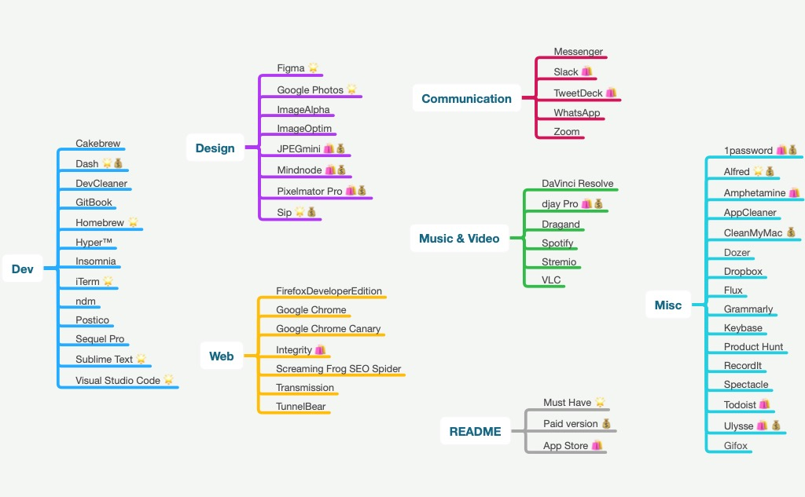

# macOS for front-end

Here is the list of all the apps I use to be efficient as a __front-end developer__.

> Design better, code faster & ship daily.

## Dev

- __[Atom 🌟](https://atom.io/)__ – The hackable text editor for the 21st Century. It's slow but the comminity is awesome.
- __[Cakebrew](https://github.com/brunophilipe/Cakebrew)__ – Manage your Homebrew formulas with style.
- __[Dash 🌟💰](https://kapeli.com/dash)__ – An API Documentation Browser and Code Snippet Manager.
- __[GitBook](https://www.gitbook.com/)__ – Create, write and organize documentation and books with your team.
- __[GitX-dev](https://rowanj.github.io/gitx/)__ – Because sometimes you need a GUI to deal with git.
- __[Hyper™](https://hyper.is/)__ – A terminal built on web technologies. Like Atom you can customise almost everything.
- __[Homebrew](https://github.com/Homebrew)__ – The missing package manager for macOS (in Ruby).
- __[Insomnia](https://insomnia.rest/)__ – A beautifull REST client. Debug APIs like a human, not a robot.
- __[iTerm 🌟](https://www.iterm2.com/)__ – A macOS terminal replacement with awesome features.
- __[ndm](https://720kb.github.io/ndm/)__ – The Open Source npm desktop GUI.
- __[Postico](https://eggerapps.at/postico/)__ – A modern PostgreSQL client.
- __[Sequel Pro](https://www.sequelpro.com/)__ – Database management application for working with MySQL databases.
- __[Sublime Text 🌟](https://www.sublimetext.com/)__ – A sophisticated text editor for code, markup and prose.

## Design

- __[Google Photos](https://photos.google.com/apps)__ – Free, unlimited storage for photos up to 16 megapixels and videos up to 1080p resolution.
- __[ImageAlpha](https://pngmini.com/)__ – Reduces file sizes of 24-bit `PNG`.
- __[ImageOptim](https://imageoptim.com/)__ – Excellent tool for publishing images on the web.
- __[JPEGmini 🛍💰](https://itunes.apple.com/fr/app/jpegmini/id498944723?l=en&mt=12)__ – Reduce photo files size by up to 80% without compromising quality.
- __[MindNode 🛍💰](https://itunes.apple.com/fr/app/mindnode-2-delightful-mind-mapping/id992076693?l=en&mt=12)__ – Delightful Mind Mapping for Mac, iPad & iPhone.
- __[Photoshop 💰](http://www.photoshop.com/)__ – Raster graphics editor since 1988.
- __[Sip 🌟](https://sipapp.io/)__ – The best color picker for Mac for collecting, organizing & sharing palettes.
- __[Sketch 💰](https://www.sketchapp.com/)__ – Professional digital design for Mac.
- __[Sketchpacks](https://www.sketchpacks.com/)__ – Browse, manage, and auto-update your Sketch plugins from the menu bar.

## Web

- __[FirefoxDeveloperEdition](https://www.mozilla.org/firefox/developer/)__ – Firefox for web developers.
- __[Google Chrome](https://www.google.com/chrome/browser/desktop/index.html)__ – Fast, simple and secure web browser, built for the modern web.
- __[Google Chrome Canary](https://www.google.com/chrome/browser/canary.html)__ – Google Chrome with a golden icon and preview for new debug tools.
- __[Integrity 🛍](https://itunes.apple.com/fr/app/integrity/id513610341?l=en&mt=12)__ – Scan your website to find broken links.
- __[Screaming Frog SEO Spider](https://www.screamingfrog.co.uk/seo-spider/)__ – Crawls websites' links, images, CSS, script and apps from an SEO perspective.
- __[Transmission](https://transmissionbt.com/download/)__ – Simple BitTorrent client.
- __[TunnelBear](https://www.tunnelbear.com/)__ – Simple, private, free access to the open Internet you.

## Communication

- __[Skype](https://www.skype.com)__ – Text message and video chat application.
- __[Slack 🛍](https://itunes.apple.com/fr/app/slack/id803453959?l=en&mt=12)__ – All your communication together in one place.
- __[TweetDeck 🛍](https://itunes.apple.com/fr/app/tweetdeck-by-twitter/id485812721?l=en&mt=12)__ – Twitter client.
- __[WhatsApp 🛍](https://itunes.apple.com/fr/app/whatsapp-desktop/id1147396723?l=en&mt=12)__ – Stay in youch with family and friends.

## Music & Video

- __[djay Pro 🛍💰](https://itunes.apple.com/fr/app/djay-pro/id947578651?l=en&mt=12)__ – The #1 DJ Software for performing DJs, integrated with iTunes and Spotify.
- __[Dragand](http://dragand.watch/)__ – Download your subtitles of your favorite series by drag and drop.
- __[Miro Video Converter](http://www.mirovideoconverter.com/)__ – Convert almost any video to `MP4`, `WebM`, `Ogg`…
- __[Spotify](https://www.spotify.com)__ – A digital music service that gives you access to millions of songs.
- __[Stremio](https://www.strem.io/)__ – Watch videos, movies, TV series and TV channels instantly.
- __[VLC](https://www.videolan.org/vlc/download-macosx.fr.html)__ – Free and open-source media player.

## Misc

- 1password
- Alfred 🌟
- Amphetamine
- AppCleaner
- CleanMyMac
- Divvy
- Dropbox
- Evernote
- Flux
- Grammarly
- Keybase
- [Product Hunt](https://github.com/producthunt/producthunt-osx/) Discover your next favorite thing, surfacing the latest in tech, books, games, and podcasts.
- RecordIt
- Rename
- RescueTime
- [Spectacle](https://github.com/eczarny/spectacle) Organize your windows without using a mouse.
- [The Unarchiver 🛍](https://itunes.apple.com/us/app/the-unarchiver/id425424353?mt=12)
- TogglDesktop
